Untitled
================

# \# Homework 2: Data Cleaning

Maryam Salehi

CS 625, Fall 2021

### Part 1. Data Cleaning

The data set consists of 1783 rows and the 5 columns: 

By looking at the data we can see a lot of errors like: - Spell check -
Repeated Names - Lower case and Upper case - Extra symbols

#### Step1: (Cleaning “what kind of pet is this” column)


Then I applied different methods and keying functions to edit the
column.

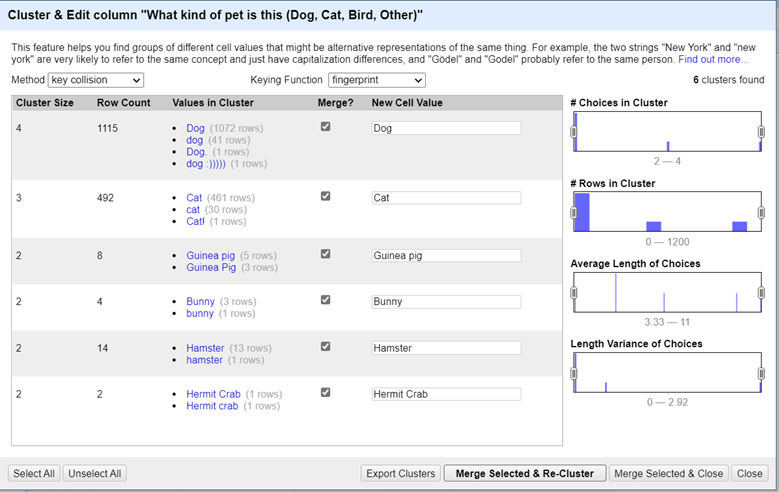


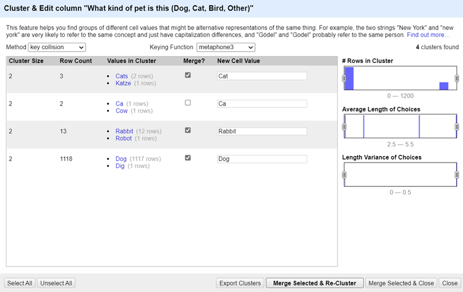

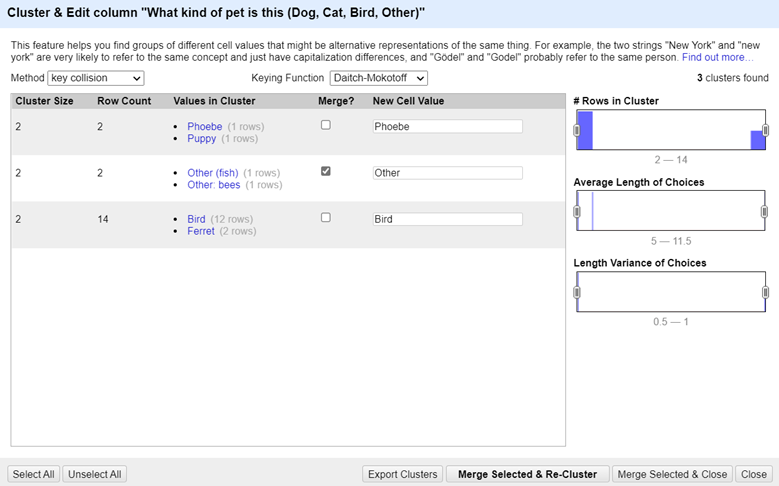


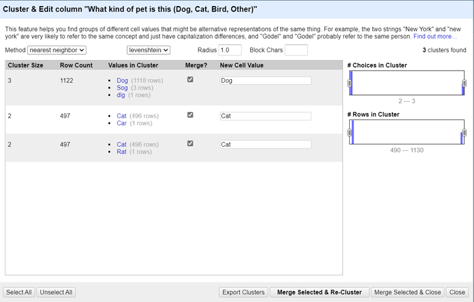

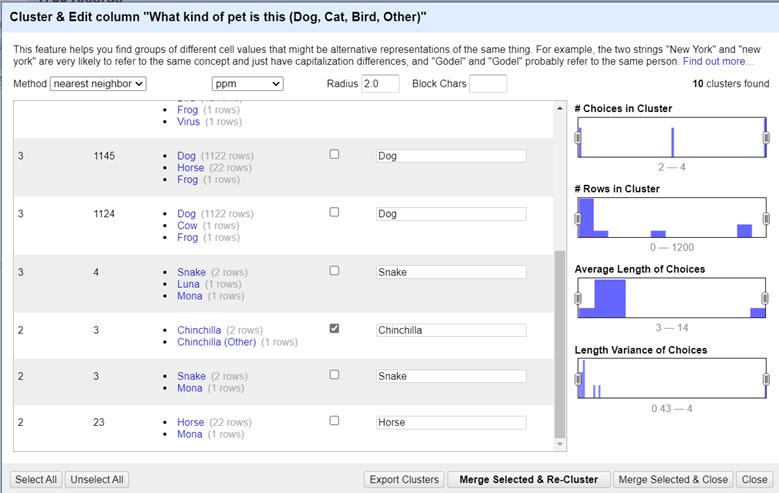

Then: Edit cells –&gt; Cluster and Edit –&gt; key collision

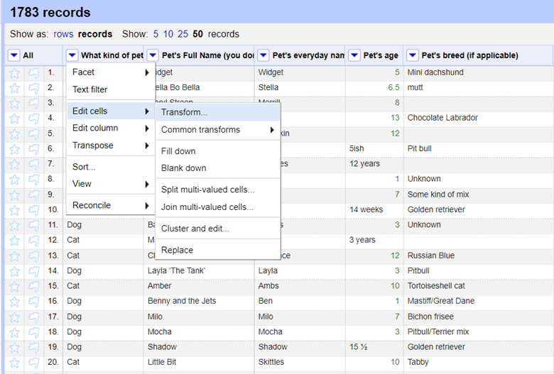

Then I found that Bunny is in Rabbit category. The same is with Tortoise
and Turtle, Gecko and Lizard, So I replaced them as follow:

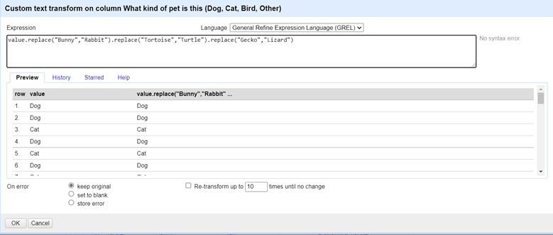

Also Beta fish and Goldfish are in the Fish category, so I replaced them
with Fish. 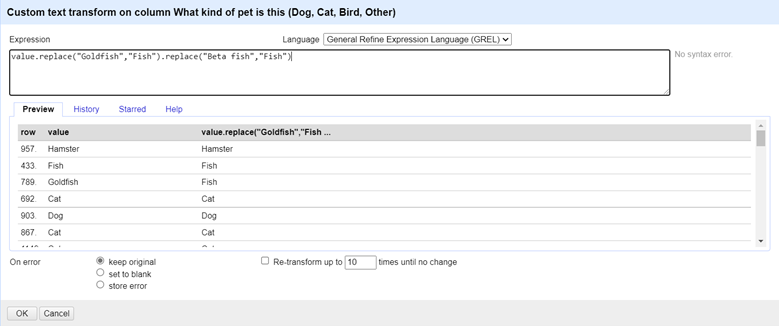

Then manually did this:

#### \*Kitten replaced with Cat

#### \*Kitty replaced with Cat

#### \*Puppy replaced with Dog

#### \*Other: prairie dog supposed Other

#### \*Dog, dog, dog , cat supposed Dog

#### \*Leopard Lizard replaced with Lizard

At the end I found that there are some blank cells in this column and I
decided to remove them:

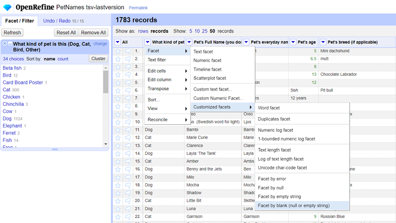

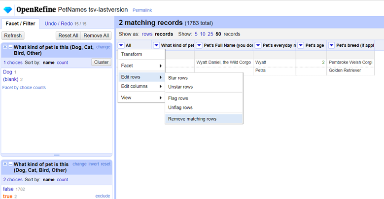

At the end of first step I ended up with 1781 rows and 32 choices for
“what kind of pet is this” column.

#### Step2: (Cleaning up “Pet\`s age” column)

First I went to Facet –&gt; Numeric facet to check the range of all
pets. We can see that it\`s 0-25.

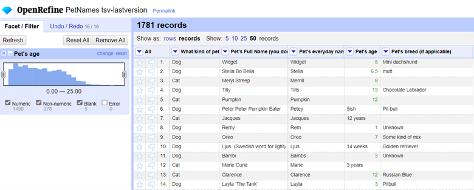

Only Non-numeric should be checked:

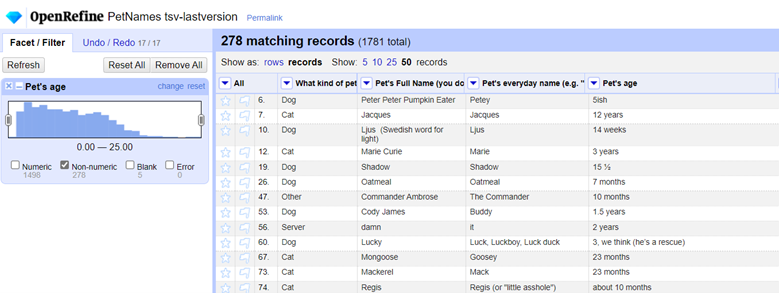

Then I went to Pet\`s age, Edit cells, Transform and I applied this:

``` p
value.replace("1/2",".5").replace("½",".5").replace(",","").replace("~","").replace("?","").replace("ish","").replace("old","")
```


After each time I made a changes in this column I checked to see all the
data is numeric:


Then I found some misspelling and errors and some extra words and I
fixed them. Also there was inconsistency in the data (week,month,year)
and I decided to convert all of them to year scale.

``` p
toNumber(value.replace("months","").replace("mos","").replace("mo","").replace("Months",""))/12.0
```


``` p
toNumber(value.replace("weeks","").replace("week",""))/52.0
```


``` p
value.replace("years","").replace("yesrs","").replace("year","")
```


``` p
value.replace(" .5",".5").replace("about","").replace("About","").replace("Almost","").replace("+","").replace("Two","2").replace("Six","6")
```


``` p
value.replace("approx.","").replace("(approx)","").replace("yrs","").replace("y","")
```


At the end I removed all the other not numeric values:


#### Step3: (Cleaning up “Pet\`s breed” column)

First I searched to see how many choices exists for this column so I
went to Pet\`s breed, Facet, Text facet. We can see that at the
beginning there are 702 choices for it:


Then I cleaned the data the same way I did for Pet\`s kinds, as follows:


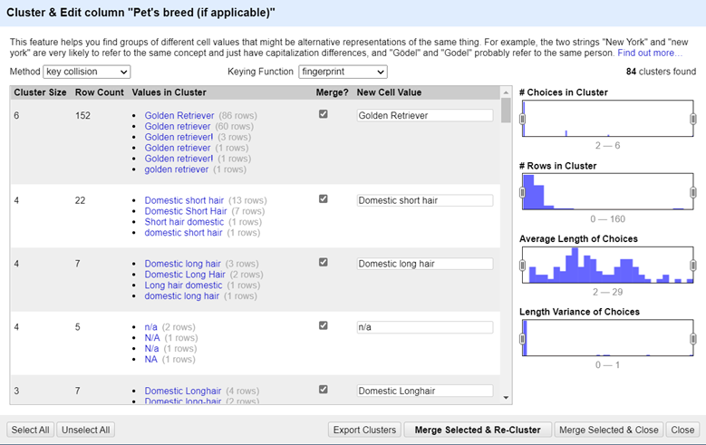

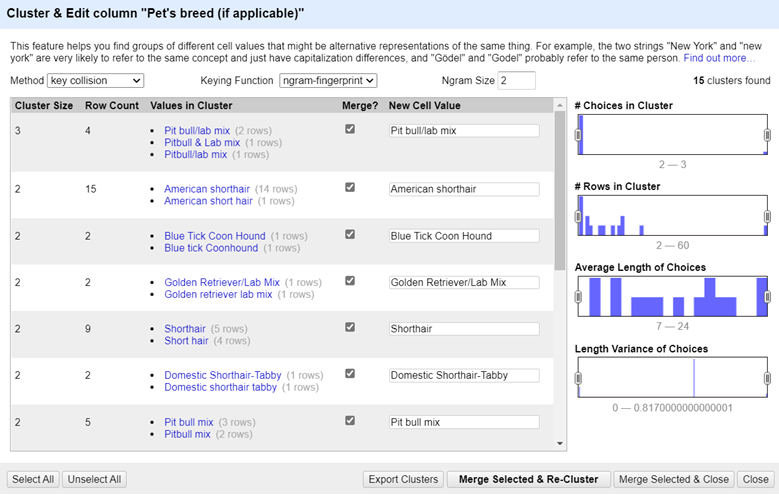

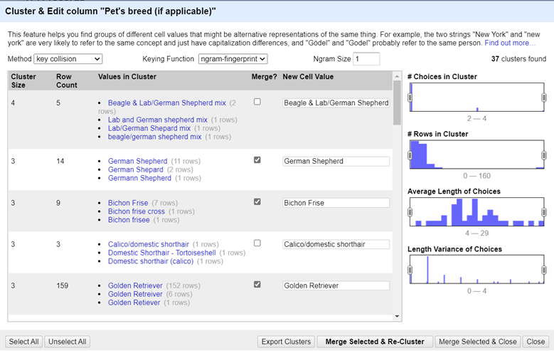

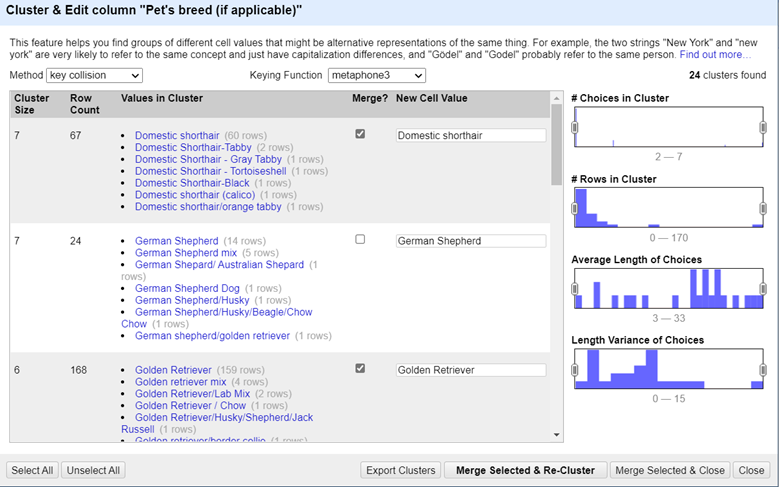

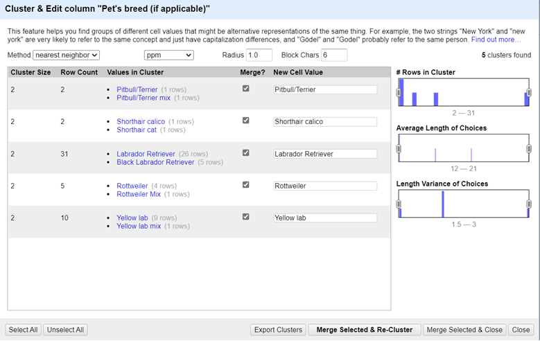

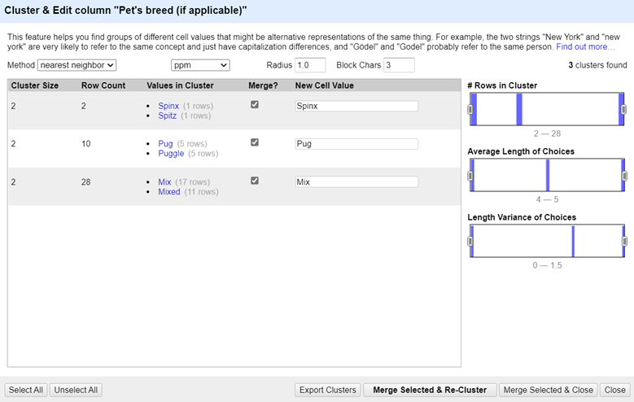

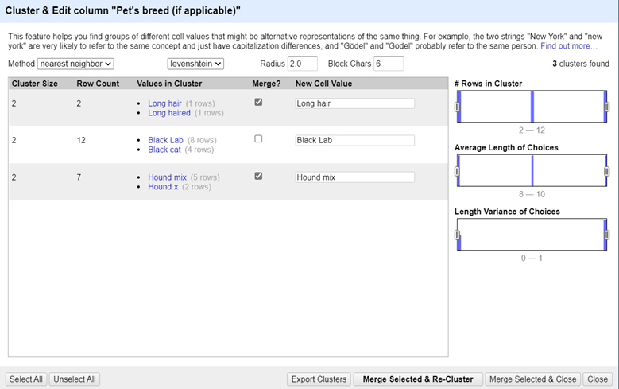

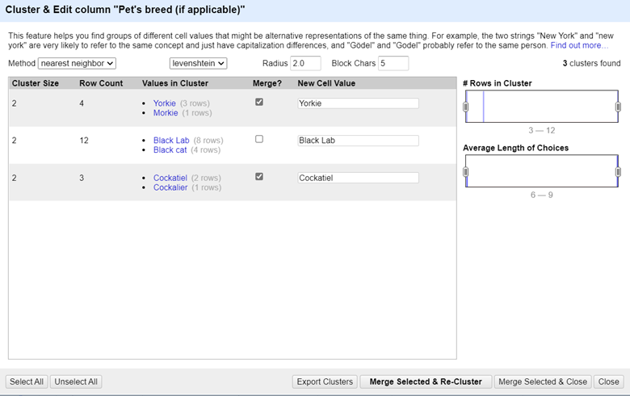

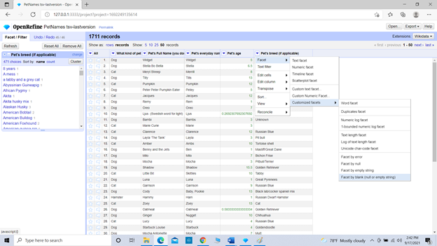


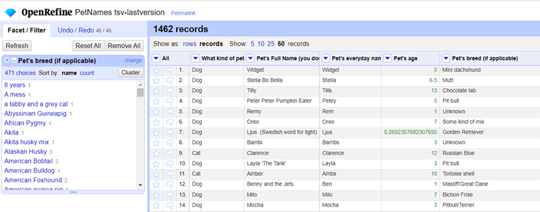

### Part 2. Analyze Cleaned Data

### 1. How many types (kinds) of pets are there?

“What kinds of pet is this”–&gt; Facet –&gt; Text facet As we can see
there are 20 choices after cleaning the data:


### 2. How many dogs?

1056


### 3. How many breeds of dogs?

335


### 4. What’s the most popular dog breed?

168

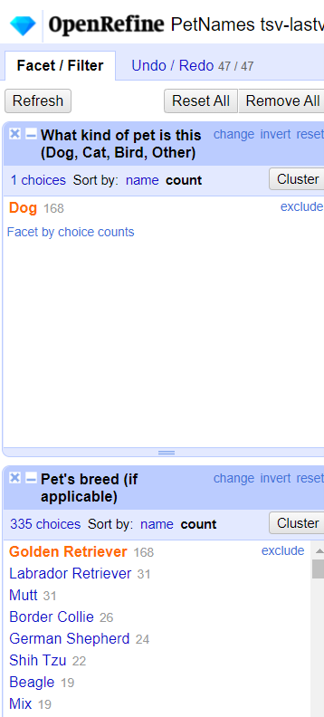

### 5. What’s the age range of the dogs?

0-25

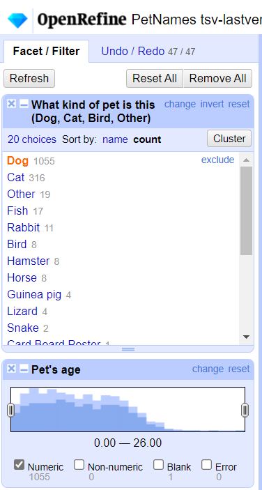

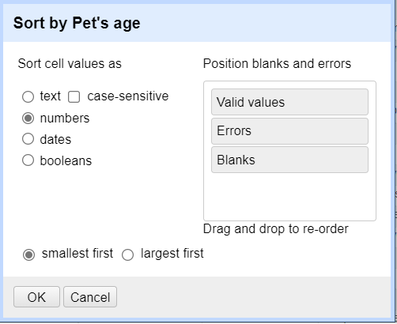


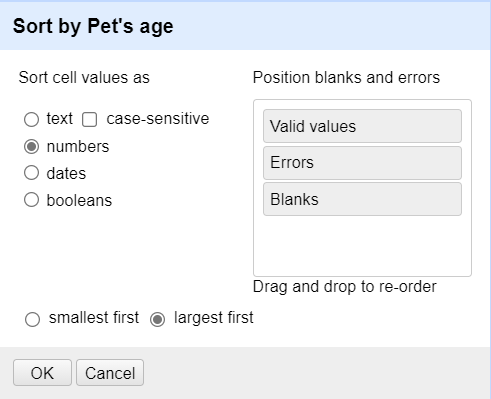


### 6. What’s the age range of the guinea pigs?

1-5


### 7. What is the oldest pet?

First Dog, Golden Retriever and then Cat, Cat


### 8. Which are more popular, betta fish or goldfish? How many of each?

10 Beta fish 3 Goldfish

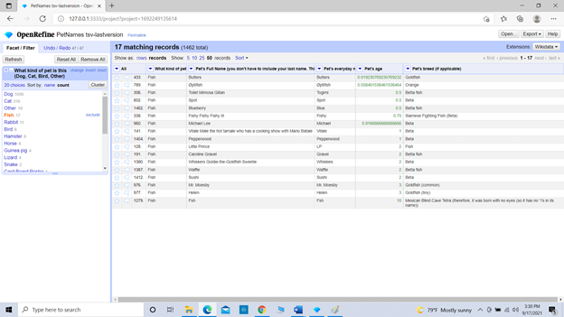

### 9. What’s the most popular everyday name for a cat?

Kitty

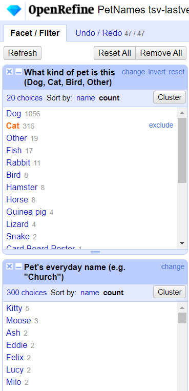

### 10. What’s the most popular full name for a dog?

Sadie

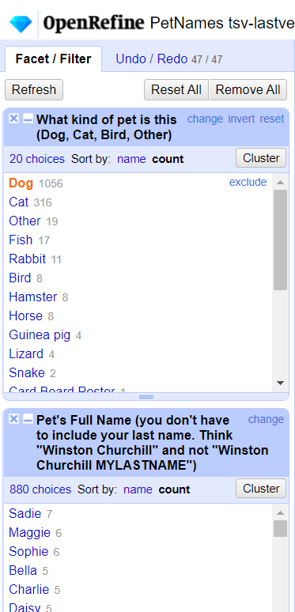

## References

<https://github.com/odu-cs625-datavis/public/blob/main/fall21/OpenRefine-Tutorial-enipedia.pdf>
<http://web.archive.org/web/20190105063215/enipedia.tudelft.nl/wiki/OpenRefine_Tutorial>
<https://github.com/odu-cs625-datavis/public/blob/main/fall21/Wk2-OpenRefine-tutorial.md>
<https://r4ds.had.co.nz/r-markdown.html>
<https://r4ds.had.co.nz/introduction.html#running-r-code>
<https://github.com/jgolbeck/petnames>

