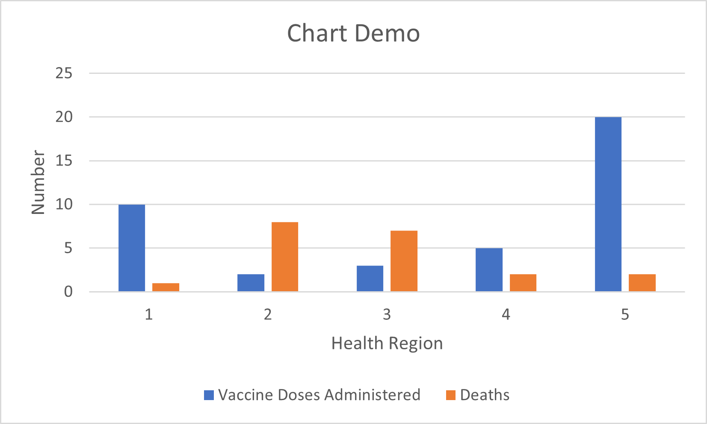
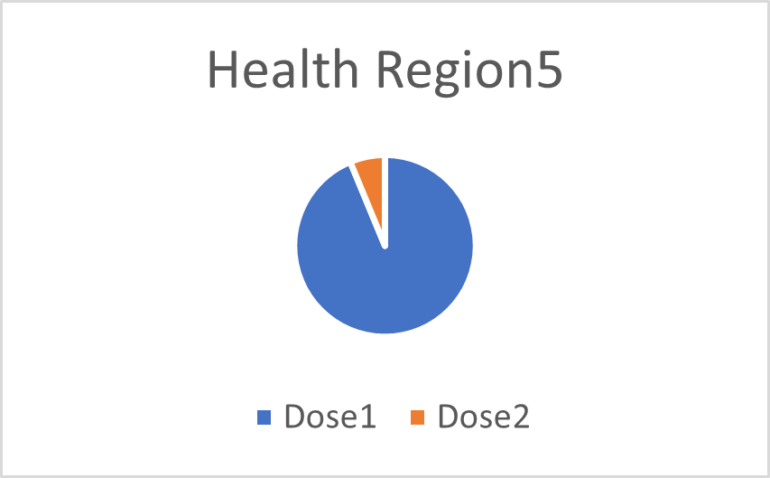

HW4-part3
================

Maryam Salehi

### part3

By looking at to both dataset, we can see that they are connected based
on region. So for the first question I propose to see how the amount of
Vaccine Doses Administered in first dataset is related to the number of
Deaths in the second dataset. At first I need to combine two dataset
based on the region and I convert all Health District to Health Region
based on the pdf provided in the last part. Then I groupby the dataset
based on Health Region and sum all the Vaccine Doses Administered for
each region. After that based on the Health Region, I created a bar
chart that represent both values for Vaccine Doses Administered and
Infections/ Hospitalization/ Deaths by side.

The plot above illustrates that each Health Region that got the most
values of Vaccine Doses Administered, has the least amount of Deaths.

For the second question, I propose to compare the Hospitalizations for
one region based on number of doses, to see if the Hospitalization
changes for 2 dose number in comparison to 1 dose. To answer this
question, again we need to combine two datasets based on regions and
then groupby the combined dataset by Health Region (That would be 5
different categories). Then I create a 5 pie chart, that each pie chart
belongs to a Health Region.

As the plot shows in the region, The number of Hospitalization for 1
dose vaccine is higher than the number of Hospitalization for 2 dose.
