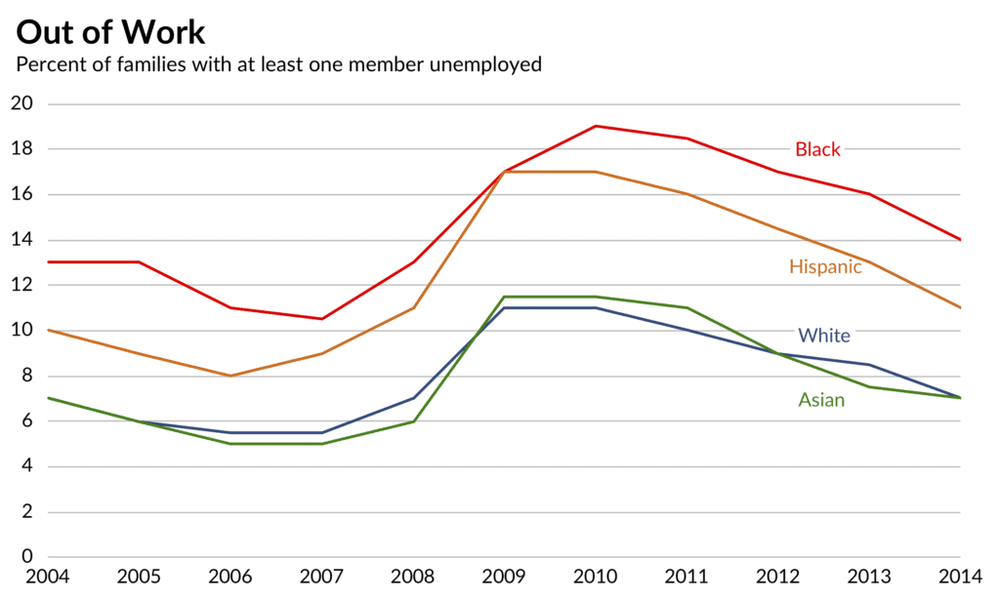
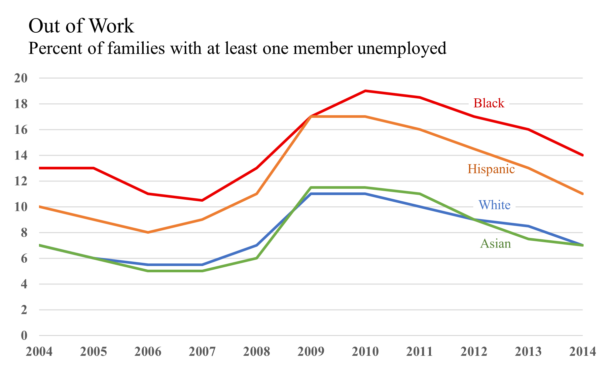
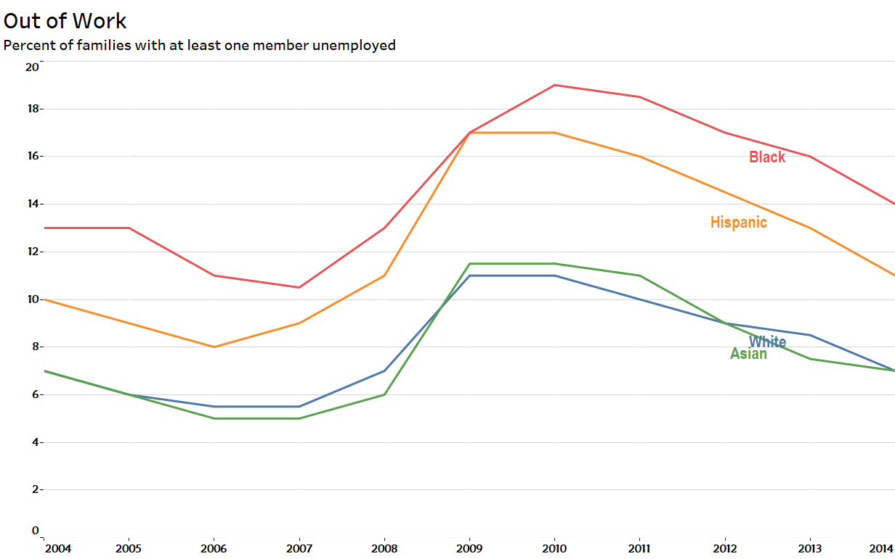
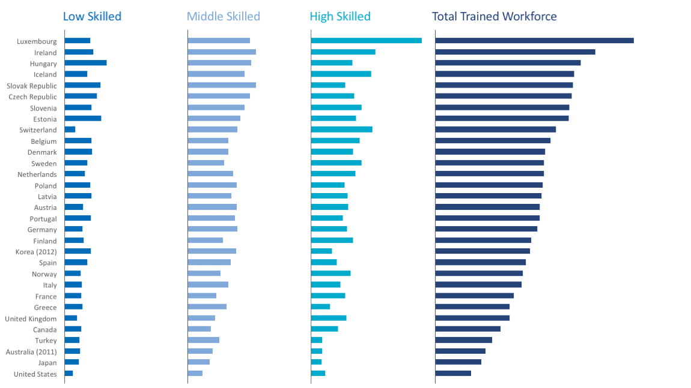
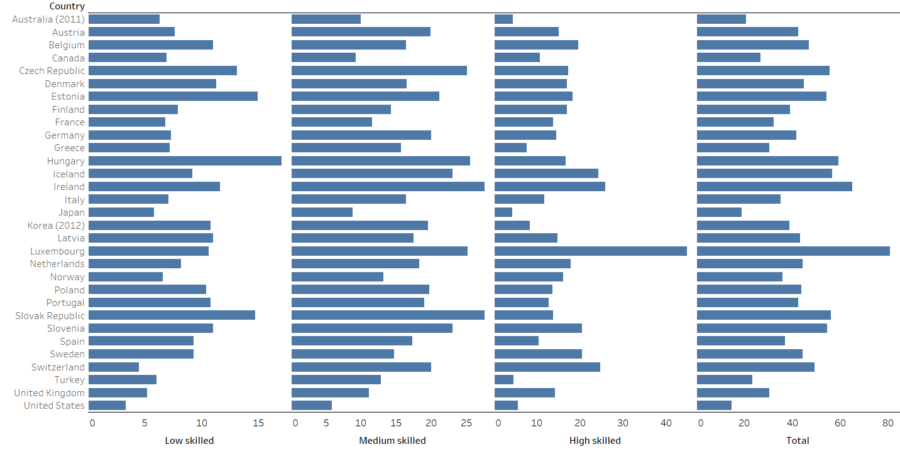
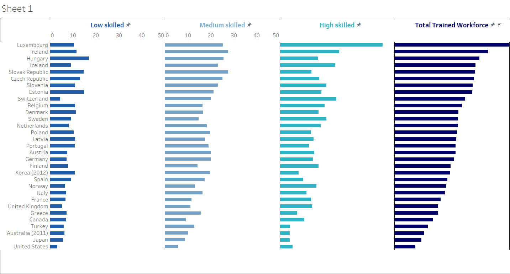
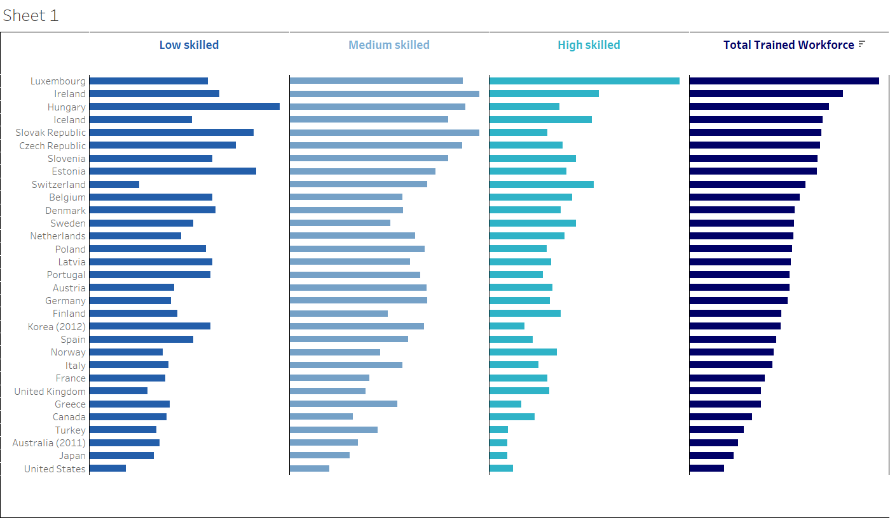
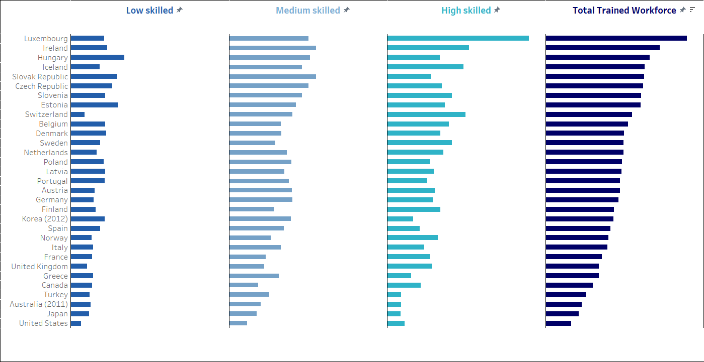

HW 3, CS 625, Fall 2021
================

Maryam Salehi

### Recreate the charts

At the beginning I planed to create the first part in Tableau and the
second part in R. For the first part I remade the line chart in Tableau
and then I started to work on the second part to recreate the bar chart
in R. Unfortunately after spending so much time on that I could not
reach to the desire result so I changed my mind and decided to go the
first part in Excel and the second part in Tableau.

### Part 1

For the first part I decided to remake the first graph,line chart.

#### Source of the Data:

Article: [Remake: Paired Column Chart from
WSJ](https://policyviz.com/2018/03/01/remake-paired-column-chart-from-wsj/)

Excel data file:
<http://policyviz.com/wp-content/uploads/2018/02/PolicyViz_WSJ_Remake.xlsx>

image: [line chart with multiple
lines](https://policyviz.com/wp-content/uploads/2018/02/PolicyViz_WSJ_Remake_LineChart-1024x613.png)

The dataset consists of 5 columns and 11 rows. Column of year shows the
years 2004-2014 and columns Black, Hispanic, White and Asian are the
percentage of families with at least one member unemployed respectively
in each ethnic. The data can be describe as bellow:

Idiom: line chart Marks: lines Channels: -Horizontal Position (X-axis)
–&gt; Ordinal data -Vertical Position (Y-axis) –&gt; Quantitative data
-Color –&gt; Categorical data

In the datset excel file, first the line chart inserted and dataset for
x-axis and y-axis added. Then for each ethnic, one line chart created
that shows the trends between 2004-2014. Then each line color fixed and
I decrease the width for each line. After that I inserted the legends to
the chart. The legends were not on the lines so I found a way to move
the legends to the lines as follows:

Right Click on one Data point –&gt; It displays the data value –&gt;
Remove the number and hold the ethnicity –&gt; Change the ‘Font’ and
‘Color’ –&gt; Choose the same color of the line –&gt; Edit the
connections that are displayed.

Then I figured out the legends are not aligned, as it should be in the
original chart.To fix this I did as follow for each line:

Write click on the line –&gt; format data labels –&gt; label position
–&gt; chose Center

All the labels should be located between 2012-2013. At the end I changed
the font to new times roman and bold both axis x and y. And Finally here
is the result:

As I mentioned above I remade this graph in Tableau too and here is the
result:

### Part 2

For this part I decided to remake small bar chart in Tableau.

#### Source of the Data:

Article: [Remaking an OECD Stacked Bar Chart (and some more general
comments)](https://policyviz.com/2017/11/30/remaking-oecd-stacked-bar-chart-general-comments/)

Excel data file:
<http://policyviz.com/wp-content/uploads/2017/11/PolicyViz_OECD_Skills_Data.xlsx>

image: [small
multiples](https://policyviz.com/wp-content/uploads/2017/11/PolicyViz_OECDStackedColumnChartRemake.png)

This dataset has 30 rows and 4 columns. The rows represent 30 countries
where the study was conducted in 2014. next 3 columns represent skill
intensity of workforce ranging from low to high, followed by total
percentage of skill intensity. The last column consists of total
business sector employment percentage in 2004.

The dataset can be describe as bellow:

Idiom: Bar chart Marks: Bars Channels: -Horizontal Length (X-axis) –&gt;
Quantitative -Vertical Position (Y-axis) –&gt; Categorical -Color –&gt;
Categorical

The first recreated chart is as shown below:

##### Initial Chart:

Steps to recreate the graph:

*Step 1*: In the Tableau, the data file was uploaded.

*Step 2*: In the table, I dragged country to row section and Low
skilled, Medium skilled, High skilled, and Total Trained Workforce to
column section.

*Step 3*: Once the initial graph was created, some adjustments were made
to simulate the original graph.(removing the grid line and changing the
fonts)

*Step 4*: The visualization in the **standard view** was set to the
**entire view**.

*Step 5*: The column **Total** was sorted from highest to the lowest
order.

*Step 6*: The labels in the bottom moved to the top:

-Drag a second copy of low skilled to Columns. -On Columns, right-click
the second copy of Low skilled, and then select Dual Axis. -Right-click
the top axis and then select Edit Axis. -Click the Tick Marks tab,
select None for both Major tick marks and Minor tick marks. -Right-click
the bottom axis and then select Edit Axis. -Under Titles, clear the
Title text box. -Do these steps for Medium skilled, High skilled and
Total.

*Step 7*: For the bars, colors were chosen from More colors option.

*Step 8*: The title heading **Total** was replaced with **Total Trained
Workforce**.

*Step 9*: The bin size of each bar was adjusted, Marks Dropdown &gt;&gt;
More Fields &gt;&gt; Select each column with bar icon &gt;&gt; Choose
Size under Marks &gt;&gt; Adjust Bin Width to match the original.

*Step 10*: To change colors of the titles, Right click on the label
&gt;&gt; Click on Format option &gt;&gt; Under the Title tab &gt;&gt;
Font Dropbox &gt;&gt; Chose appropriate colors and font to match with
the corresponding bar colors.

*Step 11*: I noticed that the values shown for the Low skilled dose not
look the same to the desired chart and by showing the X axis I figured
the range values for each part is different and they all need to be
uniform. Different ranges for x axis would result in misleading.

*Step 12*: The title of country removed.

*Step 13*: There should not be any title for the chart, so it removed.

*Step 14*: Border added to the chart.

Here is the chart after all the steps:

Here I noticed the are some sign close to the titles after I fixed the x
axis range. Then I remove the signs, but the chart returned to the point
when x axis were different:

By looking to the chart above we can see that by removing fixed x axis
the result looks very different and could result in wrong decisions.
After doing more research here is the final graph:

#### Challenges:

I could not remove the pin signs close to the titles.(I did so many
research about this issue and I tried different ways, but at the end the
chart changed and the result was far from the desired one). Also I spend
several hours to fix the border lines, but each time some part of that was
missed and the final chart is the one with the smallest missed border line.

## References:

*Tableau*

<https://www.tableau.com/learn/tutorials/on-demand/getting-started>

*Tableau Help*

<https://help.tableau.com/current/guides/get-started-tutorial/en-us/get-started-tutorial-home.htm>

*Moving Horizontal Bar Chart Headers from Bottom to Top*

<https://kb.tableau.com/articles/howto/moving-horizontal-bar-chart-headers-from-bottom-to-top>

*Fix borderline in tableau*

<https://kb.tableau.com/articles/howto/adding-borders-around-sheets-on-dashboards>

*Moving the legends to the line in excel*

<https://depictdatastudio.com/how-to-place-labels-directly-through-your-line-graph-in-microsoft-excel/>

*How To Add Direct Legends To the Chart*

<https://www.youtube.com/watch?v=VndQ49t5SJg>

*Color Codes*

<https://www.w3schools.com/colors/colors_picker.asp>

*Markdown*:

<https://www.markdownguide.org/basic-syntax>

<https://vega.github.io/vega-lite/docs/scale.html#scheme>

<https://observablehq.com/d/06499f6a4926793f>

