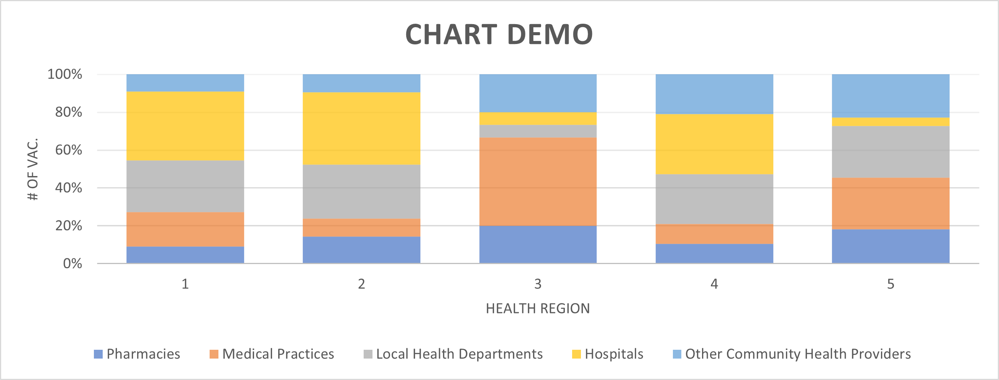

HW 4, CS 625, Fall 2021, due: 10/26/26
================

Maryam Salehi

The goal of this assignment is to propose and implement charts based on
questions asked about real-world data.

### Create the charts

For this assignment I decided to create the charts in python. Also in
order to creating charts and answer the questions, first I cleaned the
dataset in python and then I started to create the charts.

### Part 1

In this part we have a dataset that includes Weekly cases by vaccination
status by health region in Virginia. Here is the link for data:
<https://data.virginia.gov/dataset/VDH-COVID-19-PublicUseDataset-Cases-by-Vaccination/vsrk-d6hx>

The dataset consists of 8 columns and 1080 rows. Attributes are: Report
Date –&gt; Categorical, Week Ending Date –&gt; nominal, Health Region
–&gt; Categorical, Vaccination Status –&gt; Categorical, Infections
–&gt; Numerical, Hospitalizations –&gt; Numerical, Deaths –&gt;
Numerical, Population Denominator –&gt; Numerical

## Cleaning data

First I imported necessary libraries to upload and clean the data. I
mostly used pandas for cleaning and at the end I used matplotlib.pyplot
to create the chart.

Second, I saw that there are different date as “Report Date”. So I used
“unique” function to find different dates.

``` python
df['Report Date'].unique()
```

After running the code I found out there are two dates : ‘09/24/2021’,
‘10/08/2021’ and because it has been asked to choose the most recent
date, I removed all the data for ‘09/24/2021’ Report Date. Now we can
see that we have 555 data.

Then I checked to see if there is null values in dataset:

``` python
data.isnull().sum()
```

According to the question in part 1, “How has the weekly rate of
COVID-19 cases in Virginia changed over time based on vaccination
status?”, I did groupby as follows:

``` python
data_part1 = data.groupby(['Week Ending Date','Vaccination Status']).sum()
```

After that in order to normalize the values I created “Rate” column. The
values for this part calculated as follows:

``` python
data_part1['Rate'] = (data_part1['Infections']/data_part1['Population Denominator'])*100000
```

Now we have our clean dataset that contains Rate column.

In order to filter data I used Unstack function:

``` python
main_data = data_part1.unstack()
```

And finally after some manipulations I create the desired chart:


The chart above shows that how the infection changed for different
categories, Fully vaccinated, Partially vaccinated and Unvaccinated
people. As the chart demonstrate, the infection rate among vaccinated
group is very low while for unvaccinated group has increased over the
time.

Idiom: line chart Marks: lines attributes: -Week Ending Date –&gt;
Ordinal -Rate –&gt; Numerical

Channels: -Horizontal Position (X-axis) –&gt; Ordinal data -Vertical
Position (Y-axis) –&gt; Quantitative -Color –&gt; Categorical data In
this part we have one Ordinal attribute and one Numerical attribute, so
the best idiom for this is Line chart. Because we need to show different
groups on the chart I used color channel.


### Part 2

In this part we have a dataset that includes Daily vaccines administered
by health district in Virginia. Here is the link of data:
<https://data.virginia.gov/Government/VDH-COVID-19-PublicUseDataset-Vaccines-DosesAdmini/28k2-x2rj>

The dataset consists of 8 columns and 422246 rows. Attributes are:

Administration Date –&gt; Ordinal, FIPS –&gt; Categorical, Locality
–&gt; Categorical, Health District –&gt; Categorical, Facility Type
–&gt; Categorical, Vaccine Manufacturer –&gt; Categorical Dose Number
–&gt; Numerical Vaccine Doses, Administered Count –&gt; Numerical

## Cleaning data

Similar to Part 1, First I imported necessary libraries to upload and
clean the data. In this section, again I used pandas for cleaning and at
the end I used matplotlib.pyplot to create the chart.

Then I checked to see if there is null values in dataset.

At this point I figured that there are two null values in our dataset
that needs to be removed. So I used dropna function as follows to drop
null data:

``` python
data = df.dropna()
```

Then I wanted to see how many different Health District exists, so I
used unique function.

Here we can see that there are 37 Health District:

       'Prince William', 'Western Tidewater', 'Henrico', 'Peninsula',
       'Pittsylvania-Danville', 'Alexandria', 'Mount Rogers',
       'Lord Fairfax', 'Central Shenandoah', 'Rappahannock', 'Lenowisco',
       'Chesterfield', 'Loudoun', 'Crater', 'Cumberland Plateau',
       'Three Rivers', 'Virginia Beach', 'New River', 'Arlington',
       'Roanoke', 'Blue Ridge', 'Southside', 'Piedmont', 'Fairfax',
       'Chickahominy', 'Rappahannock Rapidan', 'Portsmouth',
       'Out of State', 'Alleghany', 'Norfolk', 'West Piedmont',
       'Chesapeake', 'Central Virginia', 'Not Reported', 'Eastern Shore',
       'Richmond', 'Hampton'

As it has been asked in the question, we need to remove “Out of State”
and “Not Reported” districts. Now we have 35 Health District.

After that I did some manipulation to filter the dataset for the people
who got first vaccine from Pfizer.

Finally after calculating the proportion, I created the chart as
follows:


In order to make it easier to read the name of each district, I decided
to make the bar chart horizontally. Also I added title, x label and y
label to the graph. Here is the final chart:


This chart shows that in different districts mostly people received
Pfizer as their first dose of their vaccine. The plot represent that
Hampton district has the less value while Richmond and West Piedmond
have the highest values.

Idiom: Bar chart Marks: Bars attributes: -Health District –&gt;
Categorical -Proportion –&gt; Numerical

Channels: -Horizontal Position (X-axis) –&gt; Categorical -Vertical
Position (Y-axis) –&gt; Quantitative

In this part we have one categorical attribute and one numerical
attribute. The best idiom for this data is bar chart.

### Part 3

In this section I decided to propose to create a chart that represents
the number of doses for each vaccine type within each Health Region.

In order to answer this question, First one should combine the two
datsets considering Health Region and Health District. Then one should
categorize the data of each Health District column based on Health
Region. After that dataset should be groupby based on “Health Region”
and “Vaccine Manufacturer”. At this point I would like to unique
“Vaccine Manufacture” column to see how many type of vaccine exists in
dataset. We can see that there are 4 type of vaccine: Pfizer, Moderna,
Astrazeneca, J&J. Now we can calculate the number of doses for each
vaccine type and create a bar chart that’s contains 4 small bars for
each Health Region. Here we can use color hue as a channel to
demonstrate different types of vaccine manufactures.

Idiom: Bar chart Mark: bars Channels: -Horizontal Length (X-axis) –&gt;
Categorical -Vertical Position (Y-axis) –&gt; Quantitative -Color –&gt;
Categorical


For the second question, the goal is to find that what Facility Type got
the most vaccination among different Health Regions?

To provide the best solution for this question, I am going to use
combined dataset from previous part. Then I should groupby the dataset
by “Health Region” and “Facility Type” and provide the result by counts.
Also I need to unique the Facility Type to see how many Facility Type
exist in the dataset. Finally, I would create a stacked bar chart that
shows the value for each Facility Type. By looking at the chart we can
recognize which Facility Type got the most value.



Here there are two categorical data and one quantitative data, so
satcked bar chart looks suitable. Also the question asked about which
Facility Type has the most value? So by looking to the chart we can
understand that which color for each Health Region has the most value.
According to the chart above, we can see that 'Pharmacies'has the most 
vaccinations in all Health Regions.

Idiom: Stacked bar chart Mark: bars Channels: -Horizontal Length
(X-axis) –&gt; Categorical -Vertical Position (Y-axis) –&gt;
Quantitative -Color –&gt; Categorical

## References

*Data Cleaning*

<https://realpython.com/python-data-cleaning-numpy-pandas/>

*Pandas DataFrame*

<https://pandas.pydata.org/docs/reference/api/pandas.DataFrame.groupby.html>

*Graph Plotting In Python*

<https://www.geeksforgeeks.org/graph-plotting-in-python-set-1/>

*Title and Legends In matplotlib*

<https://www.kite.com/python/answers/how-to-add-a-legend-to-a-matplotlib-plot-in-python>

*Figure Size In Python*

<https://stackoverflow.com/questions/332289/how-do-you-change-the-size-of-figures-drawn-with-matplotlib>

*Drop NaN In Python*

<https://www.kite.com/python/answers/how-to-drop-empty-rows-from-a-pandas-dataframe-in-python>

*Adjusting X-Axis*

<https://stackabuse.com/rotate-axis-labels-in-matplotlib/>

*Markdown*

<https://www.markdownguide.org/basic-syntax>

<https://vega.github.io/vega-lite/docs/scale.html#scheme>

<https://observablehq.com/d/06499f6a4926793f>
