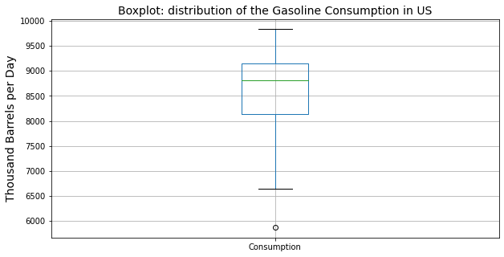
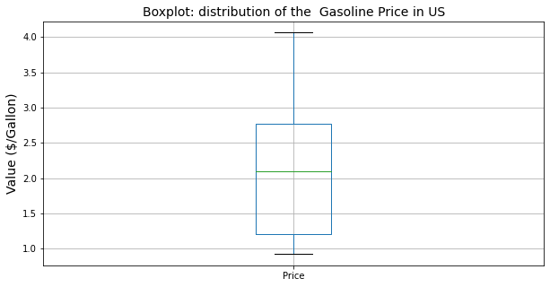
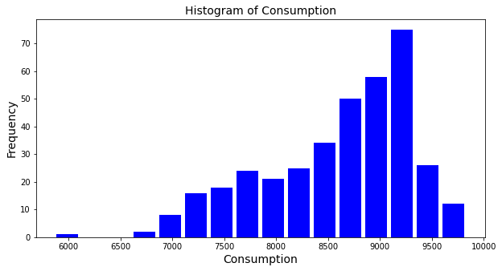
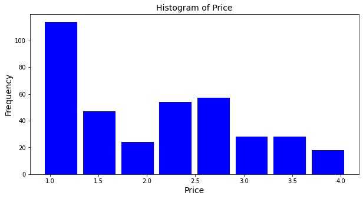
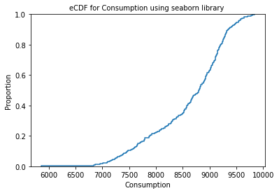
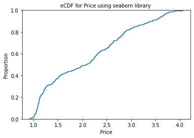
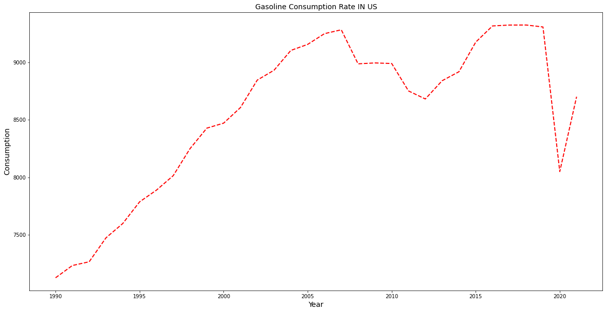
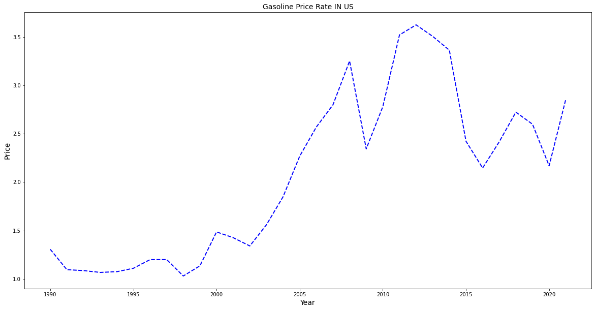

HW 6, CS 625, Fall 2021, due: 11/16/2021
================

Maryam Salehi

The goal of this assignment is to pick a dataset and use EDA process to
explore the dataset. This assignment is a part of final project in data
visualization class and we should choose a dataset that have some
knowledge about that or we are personally interested in learning more
about. Then we need to start preprocessing and cleaning the data. After
that we should generate at least 2 questions that can be most
effectively answered through visualization.

### Step 1: Choose a Dataset

For the final project I decided to work on Gasoline dataset provided in
U.S. Energy Information Administration.

Here is the link for the website: <https://www.eia.gov/>

I chose two dataset: First one contains the data for Gasoline
Consumption in the US, that provided the data from Jan 1945 till Aug
2021.

``` python
print(df_consum.shape)
```

First dataset includes 920 rows and 2 columns. The attributes are:

Month –&gt; Categorical

U.S. Product Supplied of Finished Motor Gasoline Thousand Barrels per
Day –&gt; Quantitative


Second dataset contains the data for Gasoline price in the US, which
provided the data from Sep 1390 till Oct 2021.

``` python
print(df_price.shape)
```

Second dataset includes 374 rows and 2 columns. The attributes are:

Month –&gt; Categorical

U.S. Regular All Formulations Retail Gasoline Prices Dollars per Gallon
–&gt; Quantitative

### Step 2: Start the EDA Process

In this section I decided to to merge two dataset and create a main
dataset. By looking at the datasets I figoured that for the first one,
there are more data available than the second one. In order to merge two
dataset, they should have the same amount of Month, that means both
datasets are common in Month between Sep 1990 to Aug 2021. So I removed
some data from each dataset and at the end concatenate them for similar
Month:

``` python
df_price.drop([0,1],inplace=True)
df_consum.drop(df_consum.index[372:920], inplace=True)
frames =[df_consum, df_price]
df_consum.index = df_price.index
data = pd.concat(frames, axis=1)
```

At this point I saw that there are two columns for Month and one of them
need to be removed:

``` python
main_data = data.loc[:,~data.columns.duplicated()]
```

Then in order to make it easier using dataset I changed the name for two
column:

    U.S. Product Supplied of Finished Motor Gasoline Thousand Barrels per Day --> Consumption 

    U.S. Regular All Formulations Retail Gasoline Prices Dollars per Gallon --> Price

``` python
main_data.rename(columns={"U.S. Product Supplied of Finished Motor Gasoline Thousand Barrels per Day": "Consumption", "U.S. Regular All Formulations Retail Gasoline Prices Dollars per Gallon": "Price"}, inplace=True) 
```

And now the main dataset is created.

First for gain some information about the dataset I run this code:

``` python
main_data.describe()
```

the main dataset includes 372 rows and 3 column:

Month –&gt; Categorical

Consumption –&gt; Quantitative

Price –&gt; Quantitative

Next I checked to see if there is null value in the main dataset and
because there were two null values I needed to drop them:

``` python
main_data.isnull().sum()
main_data.dropna(inplace=True)
```

Now I have a dataset with 370 rows and 3 columns.

In order to gain more information about attributes I ploted boxplot for
Price and Consumption as follows:

``` python
plt.figure(figsize=(10, 5))
boxplot_cons= main_data.boxplot(column=['Consumption'])
plt.title('Boxplot: distribution of the Gasoline Consumption in US',fontsize=14, color='black')
plt.ylabel('Thousand Barrels per Day', fontsize=14, color='black')
```



``` python
plt.figure(figsize=(10, 5))
boxplot_price = main_data.boxplot(column=['Price'])
plt.title('Boxplot: distribution of the  Gasoline Price in US',fontsize=14, color='black')
plt.ylabel('Value ($/Gallon)', fontsize=14, color='black')
```



We conclude that the range for Consumption attribute is approximately
8100-9100 while the range for Price attribute is around 1.25-2.75.From
this chart I can easily see the statistical information about the
datasets and there are no outliers.

After that I decided to create histogram for each attribute:

``` python
plt.figure(figsize=(10, 5))
plt.hist(x = main_data['Consumption'], bins=10, color='blue', rwidth=0.85)
plt.title('Histogram of Consumption',fontsize=14, color='black')
plt.xlabel('Consumption', fontsize=14, color='black')
plt.ylabel('Frequency', fontsize=14, color='black')
```

 The chart above illustrate that the most
frequency of consumption is around 9250.

``` python
plt.figure(figsize=(10, 5))
plt.hist(x = main_data['Price'], bins=10, color='blue', rwidth=0.85)
plt.title('Histogram of Price',fontsize=14, color='black')
plt.xlabel('Price', fontsize=14, color='black')
plt.ylabel('Frequency', fontsize=14, color='black')
```



The plot above shows that the most frequency for price of gasoline is
around 1$/Gal.

In next step I created eCDF chart for each attribute:

``` python
import seaborn as sns
sns.ecdfplot(x = main_data['Consumption'])
plt.title('eCDF for Consumption using seaborn library ',fontsize=10, color='black')
```



``` python
sns.ecdfplot(x = main_data['Price'])
plt.title('eCDF for Price using seaborn library ',fontsize=10, color='black')
```



In the charts above I could see the proportion of distributions for each
attribute in all dataset.

Further I decided to create a chart that shows how the Price and
Consumption has changed over the time. At this point I noticed that there
is monthly data for time and regarding to have so many monthly data which
can not be presented in a chart, I figured to convert it to year
data.

``` python
import datetime
main_data['Month-Year']=[datetime.datetime.strptime(x,'%b-%y').strftime('%m-%Y') for x in main_data['Month']]
main_data['Year']=''
for i in range(len( main_data)):
    main_data['Year'].values[i]= pd.to_numeric(main_data['Month-Year'].values[i][3:7])
```

After creating Year column, I needed to groupby the dataset by Year and for
each Year I replaced the mean value for price and consumption.

```python
final_data = main_data.groupby(['Year']).mean()
```

So final_data is the cleaned dataset that I am planning to work with.

According to this question
scatter plot seems an appropriate idiom for these two graphs:

``` python
plt.figure(figsize=(20, 10))
plt.plot('Year', 'Consumption', data= main_data, linewidth=2, linestyle='--', color = 'red')
plt.title('Gasoline Consumption Rate IN US',fontsize=14, color='black')
plt.xlabel('Year', fontsize=14, color='black')
plt.ylabel('Consumption', fontsize=14, color='black')
plt.show()
```




``` python
plt.figure(figsize=(20, 10))
plt.plot('Year', 'Price', data= main_data, linewidth=2, linestyle='--', color = 'blue')
plt.title('Gasoline Price Rate IN US',fontsize=14, color='black')
plt.xlabel('Year', fontsize=14, color='black')
plt.ylabel('Price', fontsize=14, color='black')
plt.show()
```



Then I looked for the Month with highest consumption and highest price
over the last 30 year. Here is the results:

``` python
high_consumption = main_data[main_data['Consumption']>9700] 
```

``` python
high_price = main_data[main_data['Price']>3.85] 
```

According to this analyses first Month with high consumption are:

Month Consumption Price Aug-19 9834 2.621 Jun-19 9703 2.716 Aug-18 9778
2.836 Jun-18 9797 2.891 Aug-17 9752 2.380 Jun-17 9772 2.347

While first Month with high price are:

Month Consumption Price Apr-12 8741 3.900 Mar-12 8582 3.852 May-11 8817
3.906 Jul-08 9150 4.062 Jun-08 9110 4.054

### In conclusions, the month of August and Jun have the most values for consumption, which probably is mostly about summer vacations. On the other hand the highest value for price was in March and April in 2012, then May in 2011 and July and Jun in 2008.

## References

*Energy Information Adminastration*

<https://www.eia.gov>

*Exploratory Data Analysis*

<https://r4ds.had.co.nz/exploratory-data-analysis.html>

*Pandas DataFrame*

<https://pandas.pydata.org/docs/reference/api/pandas.DataFrame.groupby.html>

<https://pandas.pydata.org/pandas-docs/stable/reference/api/pandas.DataFrame.rename.html>

<https://stackoverflow.com/questions/39768547/replace-whole-string-if-it-contains-substring-in-pandas>

*Bins In Histogram*

<https://www.kite.com/python/answers/how-to-set-the-bin-size-of-a-matplotlib-histogram-in-python>

*Concatenate*

<https://pandas.pydata.org/pandas-docs/stable/user_guide/merging.html>

*MATPLOTLIB*

<https://matplotlib.org/stable/gallery/text_labels_and_annotations/date.html>

<https://www.tutorialspoint.com/matplotlib/matplotlib_setting_ticks_and_tick_labels.htm>

*Title and Legends In matplotlib*

<https://www.kite.com/python/answers/how-to-add-a-legend-to-a-matplotlib-plot-in-python>

*eCDF Chart In seaborn*

<https://machinelearningmastery.com/empirical-distribution-function-in-python/>

*Markdown*

<https://www.markdownguide.org/basic-syntax>

<https://vega.github.io/vega-lite/docs/scale.html#scheme>

<https://observablehq.com/d/06499f6a4926793f>
