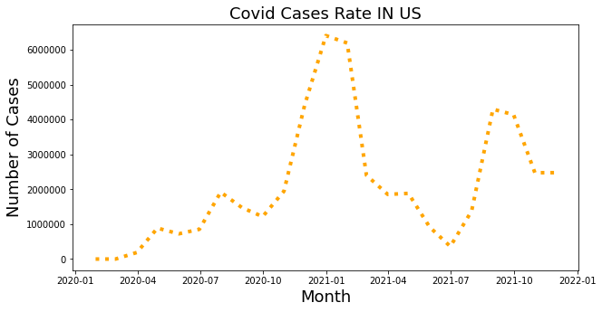

HW 7, CS 625, Fall 2021, due: 11/30/2021
================

Maryam Salehi

The goal of this assignment is to continue the EDA process that I
started in HW6.Also identify and gather the 2nd dataset needed to
address the questions I developed in HW6. Starting with the questions I
developed in HW6, continue the EDA process to further explore the
combination of the two datasets.

For the final project I decided to work on Gasoline dataset provided in
U.S. Energy Information Administration.

Here is the link for the website: <https://www.eia.gov/>

I chose two dataset: First one contains the data for Gasoline
Consumption in the US, that provided the data from Jan 1945 till Aug
2021.

Second dataset contains the data for Gasoline price in the US, which
provided the data from Sep 1930 till Oct 2021.

After merging two datasets and cleaning the final dataset, I ended up to
the main dataset which includes 37o rows and 3 column.

Then I created boxplots, histograms and eCDF for each attribute and
after applying EDA process, I created 2 line chart that shows how the
Price and Consumption has changed over the time in the US. Here are the
charts:


By looking at these two charts I concluded that gasoline consumption and
price has increased over the time in last 30 years.Although there are
some points that both consumption and prices have decreased but in
overall both are increased.

After plotting these two charts, I noticed that there is a sharp
reduction in 2020 in both gasoline price and consumption. As we know the
most significant world event in 2020 is covid pandemic, so I decided to
look into covid dataset cases and deaths to see if the corona virus
could affect the gasoline consumption and price in 2020.

Here is the covid 19 dataset: <https://github.com/nytimes/covid-19-data>

In order to have a better understanding of the second dataset, I started
implementing EDA process. Further, I created boxplots, histograms and
eCDF for both attributes, cases and deaths.


Next I plotted the line chart for cases and deaths:




At this point I noticed that its hard to read y-axis numbers, so I
divided all the numbers by 1 million:

``` python
df_final['cases(m)'] = df_final['cases']/1000000 
df_final['deaths(m)'] = df_final['deaths']/1000000 
```

Then I limited the dateset just for 2020 and fixed the x-axis based on
month’s name.

``` python
plt.figure(figsize=(10, 5))
date = ['Jan','Feb','Mar','Apr','May','Jun','Jul','Aug','Sep', 'Oct', 'Nov', 'Dec']
plt.figure(figsize=(10, 5))
plt.plot(date, df_2020['cases(m)'], linewidth=4,linestyle='dotted', color = 'orange')
plt.title('Covid Cases Rate IN US (2020)',fontsize=18, color='black')
plt.xlabel('Month', fontsize=18, color='black')
plt.ylabel('Number of Cases (million)', fontsize=18, color='black')
plt.ticklabel_format(style='plain',axis='y') 
plt.show()
```


``` python
plt.figure(figsize=(10, 5))
date = ['Jan','Feb','Mar','Apr','May','Jun','Jul','Aug','Sep', 'Oct', 'Nov', 'Dec']
plt.figure(figsize=(10, 5))
plt.plot(date, df_2020['deaths(m)'], linewidth=4,linestyle='dotted', color = 'red')
plt.title('Covid Death Rate IN US (2020)',fontsize=18, color='black')
plt.xlabel('Month', fontsize=18, color='black')
plt.ylabel('Number of Death (million)', fontsize=18, color='black')
plt.ticklabel_format(style='plain',axis='y') 
plt.show()
```


The figure above represent the covid cases rate in 2020.Here I decided
to create a line chart (from previouse dataset used in HW6) that shows
how the gasoline consumption and price changed in 2020 monthly. At the
end I want to examine the charts to see if there is any relationship
between number of cases and gasoline consumption and price during
pandemic.

``` python
plt.figure(figsize=(10, 5))
month = ['Jan','Feb','Mar','Apr','May','Jun','Jul','Aug','Sep', 'Oct', 'Nov', 'Dec']
plt.plot(month, data_gas_2020['Price'], linewidth=4, linestyle='--', color = 'purple')
plt.title('Gasoline Price Rate IN 2020',fontsize=14, color='black')
plt.xlabel('Month', fontsize=14, color='black')
plt.ylabel('Price', fontsize=14, color='black')
plt.xticks(rotation = 45)
plt.show()
```


``` python
plt.figure(figsize=(10, 5))
month = ['Jan','Feb','Mar','Apr','May','Jun','Jul','Aug','Sep', 'Oct', 'Nov', 'Dec']
plt.plot(month, data_gas_2020['Consumption'], linewidth=4, linestyle='--', color = 'rosybrown')
plt.title('Gasoline Consumption Rate IN 2020',fontsize=14, color='black')
plt.xlabel('Month', fontsize=14, color='black')
plt.ylabel('Consumption', fontsize=14, color='black')
plt.xticks(rotation = 45)
plt.show()
```


Next I want to compare the change rate of the gas price and consumption
in 2020 to 2018 1nd 2019.

``` python
# Create gas price chart for years before 2020
plt.figure(figsize=(10, 5))
month = ['Jan','Feb','Mar','Apr','May','Jun','Jul','Aug','Sep', 'Oct', 'Nov', 'Dec']
plt.plot(month, data_gas_2018['Price'], linewidth=2, linestyle='--', color = 'indianred')
plt.plot(month, data_gas_2019['Price'], linewidth=2, linestyle='--', color = 'lightgreen')
plt.plot(month, data_gas_2020['Price'], linewidth=4, linestyle='-', color = 'blue')
plt.title('Gasoline Price Rate',fontsize=14, color='black')
plt.xlabel('Month', fontsize=14, color='black')
plt.ylabel('Price', fontsize=14, color='black')
plt.xticks(rotation = 45)
plt.show()
```


``` python
# Create gas consumption chart for years before 2020
plt.figure(figsize=(10, 5))
month = ['Jan','Feb','Mar','Apr','May','Jun','Jul','Aug','Sep', 'Oct', 'Nov', 'Dec']
plt.plot(month, data_gas_2018['Consumption'], linewidth=2, linestyle='--', color = 'indianred')
plt.plot(month, data_gas_2019['Consumption'], linewidth=2, linestyle='--', color = 'lightgreen')
plt.plot(month, data_gas_2020['Consumption'], linewidth=4, linestyle='-', color = 'blue')
plt.title('Gasoline Consumption Rate',fontsize=14, color='black')
plt.xlabel('Month', fontsize=14, color='black')
plt.ylabel('Consumption', fontsize=14, color='black')
plt.xticks(rotation = 45)
plt.show()
```


Further I want to investigate “how lock down timeline during covid
pandemic could affect the consumption of gasoline and also the price of
it?”.

For answering this question I will create a chart that displays all the
data for covid and gas price and gas consumption in 2020 in multiple
small chart. Here is the draft chart:


For the second question I propose to study "how the covid infection rate
after vaccination, affected the price of the gas. In order to answer
this question I will provide a bar chart for each month, after
vaccination, and display the changes of covid cases and price for that
time.


## References

*Energy Information Adminastration*

<https://www.eia.gov>

*nytimes covid data*

<https://github.com/nytimes/covid-19-data>

*avoid scientific notation in matplotlib*

<https://stackoverflow.com/questions/28371674/prevent-scientific-notation-in-matplotlib-pyplot>

*colors name in python*

<https://matplotlib.org/3.1.0/gallery/color/named_colors.html>

*Exploratory Data Analysis*

<https://r4ds.had.co.nz/exploratory-data-analysis.html>

*Pandas DataFrame*

<https://pandas.pydata.org/docs/reference/api/pandas.DataFrame.groupby.html>

<https://pandas.pydata.org/pandas-docs/stable/reference/api/pandas.DataFrame.rename.html>

<https://stackoverflow.com/questions/39768547/replace-whole-string-if-it-contains-substring-in-pandas>

*Bins In Histogram*

<https://www.kite.com/python/answers/how-to-set-the-bin-size-of-a-matplotlib-histogram-in-python>

*Concatenate*

<https://pandas.pydata.org/pandas-docs/stable/user_guide/merging.html>

*MATPLOTLIB*

<https://stackoverflow.com/questions/19125722/adding-a-legend-to-pyplot-in-matplotlib-in-the-simplest-manner-possible>

<https://matplotlib.org/stable/gallery/text_labels_and_annotations/date.html>

<https://www.tutorialspoint.com/matplotlib/matplotlib_setting_ticks_and_tick_labels.htm>

*Title and Legends In matplotlib*

<https://www.kite.com/python/answers/how-to-add-a-legend-to-a-matplotlib-plot-in-python>

*eCDF Chart In seaborn*

<https://machinelearningmastery.com/empirical-distribution-function-in-python/>

*Markdown*

<https://www.markdownguide.org/basic-syntax>

<https://vega.github.io/vega-lite/docs/scale.html#scheme>

<https://observablehq.com/d/06499f6a4926793f>
