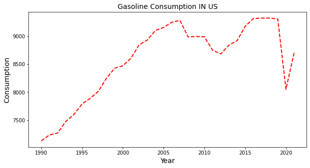
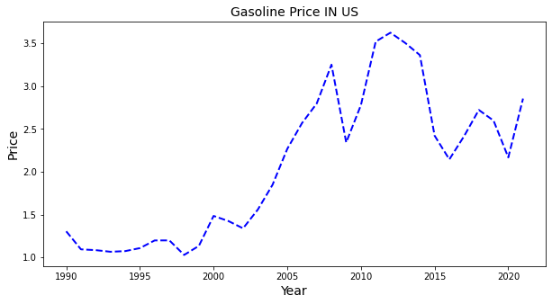
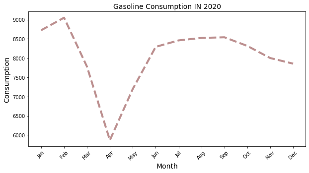
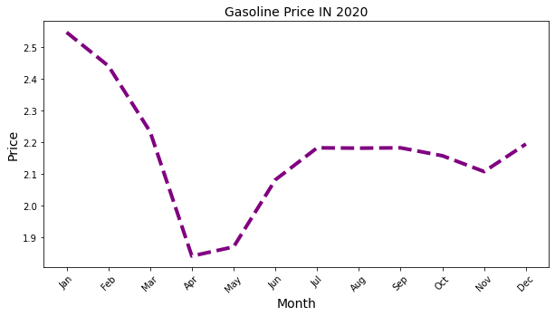
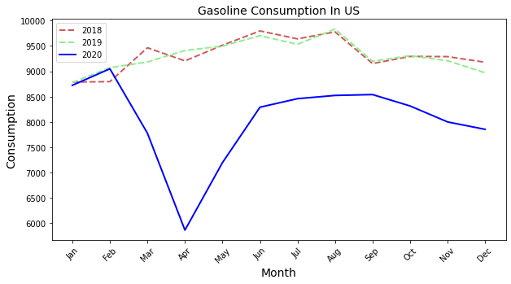
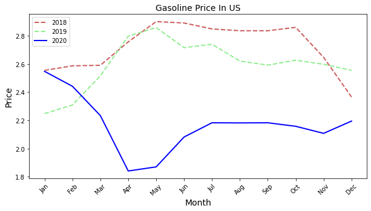
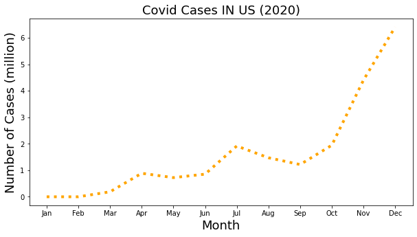

HW 8, CS 625, Fall 2021, due: 12/12/2021
================

Maryam Salehi

#### The goal of this assignment is to create one of the charts proposed in previous homework.

### Overview:

For the final project I decided to investigate gasoline consumption and
price over the last 30 years in the U.S. Gasoline dataset and
information provided in U.S. Energy Information Administration.

Here is the link for the website: <https://www.eia.gov/>

I chose two dataset: First one contains the data for Gasoline
Consumption in the US, that provided the data from Jan 1945 till Aug
2021.

Second dataset contains the data for Gasoline price in the US, which
provided the data from Sep 1930 till Oct 2021.

After merging two datasets and cleaning the final dataset, I ended up to
the main dataset which includes 37o rows and 3 column.

Then I created boxplots, histograms and eCDF for each attribute and
after applying EDA process, I created 2 line chart that shows how the
Price and Consumption has changed over the time in the US.

All the Data cleaning, wrangling, EDA processing and charts creating in
this project done with python. Here are the charts:





By looking at these two charts I concluded that gasoline consumption and
price has increased over the time in last 30 years.Although there are
some points that both consumption and prices have decreased but in
overall both are increased.

After plotting these two charts, I noticed that there is a sharp
reduction in 2020 in both gasoline price and consumption. And here is
the gasoline consumption and price in 2020:

``` python
plt.figure(figsize=(10, 5))
month = ['Jan','Feb','Mar','Apr','May','Jun','Jul','Aug','Sep', 'Oct', 'Nov', 'Dec']
plt.plot(month, data_gas_2020['Consumption'], linewidth=4, linestyle='--', color = 'rosybrown')
plt.title('Gasoline Consumption Rate IN 2020',fontsize=14, color='black')
plt.xlabel('Month', fontsize=14, color='black')
plt.ylabel('Consumption', fontsize=14, color='black')
plt.xticks(rotation = 45)
plt.show()
```



``` python
plt.figure(figsize=(10, 5))
month = ['Jan','Feb','Mar','Apr','May','Jun','Jul','Aug','Sep', 'Oct', 'Nov', 'Dec']
plt.plot(month, data_gas_2020['Price'], linewidth=4, linestyle='--', color = 'purple')
plt.title('Gasoline Price Rate IN 2020',fontsize=14, color='black')
plt.xlabel('Month', fontsize=14, color='black')
plt.ylabel('Price', fontsize=14, color='black')
plt.xticks(rotation = 45)
plt.show()
```



Next I want to compare gas consumption and price in 2020 to 2018 1nd
2019. So here is the chart:

``` python
# Create gas consumption chart for years before 2020
plt.figure(figsize=(10, 5))
month = ['Jan','Feb','Mar','Apr','May','Jun','Jul','Aug','Sep', 'Oct', 'Nov', 'Dec']
plt.plot(month, data_gas_2018['Consumption'], linewidth=2, linestyle='--', color = 'indianred')
plt.plot(month, data_gas_2019['Consumption'], linewidth=2, linestyle='--', color = 'lightgreen')
plt.plot(month, data_gas_2020['Consumption'], linewidth=4, linestyle='-', color = 'blue')
plt.title('Gasoline Consumption Rate',fontsize=14, color='black')
plt.xlabel('Month', fontsize=14, color='black')
plt.ylabel('Consumption', fontsize=14, color='black')
plt.xticks(rotation = 45)
plt.show()
```



``` python
# Create gas price chart for years before 2020
plt.figure(figsize=(10, 5))
month = ['Jan','Feb','Mar','Apr','May','Jun','Jul','Aug','Sep', 'Oct', 'Nov', 'Dec']
plt.plot(month, data_gas_2018['Price'], linewidth=2, linestyle='--', color = 'indianred')
plt.plot(month, data_gas_2019['Price'], linewidth=2, linestyle='--', color = 'lightgreen')
plt.plot(month, data_gas_2020['Price'], linewidth=4, linestyle='-', color = 'blue')
plt.title('Gasoline Price Rate',fontsize=14, color='black')
plt.xlabel('Month', fontsize=14, color='black')
plt.ylabel('Price', fontsize=14, color='black')
plt.xticks(rotation = 45)
plt.show()
```



As we know the most significant world event in 2020 is covid pandemic,
so I decided to look into covid dataset cases and deaths to see if the
corona virus situation could affect the gasoline consumption and price
in 2020.

Here is the covid 19 dataset: <https://github.com/nytimes/covid-19-data>

In order to have a better understanding of the second dataset, I started
implementing EDA process. Further, I created boxplots, histograms and
eCDF for both attributes, cases and deaths. After that I created a line
chart for infection cases during covid19:



Further I want to investigate “how situation during covid pandemic (such
as lockdown and reopening) could affect the consumption of gasoline and
maybe the price of it?”.

Here is the proposed chart for answering this question from previous homework:


In general gas prices can be affected by many things, but gas
consumption can be affected directly by Covid restrictions.

For answering the question I ended up with a multiple small chart that
incluesd 3 subplots:

``` python
fig, ax = plt.subplots(3, sharex=False, figsize=(10,8))
ax[0].plot(date,x, color = 'royalblue',linewidth=2.5)
ax[1].plot(month_2021,(data_gas_2021['Consumption'][::-1])/1000, linewidth=2,linestyle='dashed',color = 'purple', label ='2021')
ax[1].plot(date,y, color = 'royalblue', label ='2020',linewidth=2.5)
ax[1].plot(date,(data_gas_2018['Consumption'][::-1])/1000,linewidth=2,linestyle='--', color = 'red',label ='2018')
ax[1].plot(date,(data_gas_2019['Consumption'][::-1])/1000,linewidth=2,linestyle='dotted', color = 'lime', label ='2019')
ax[2].plot(month_2021,(data_gas_2021['Price'][::-1]), linewidth=2,linestyle='dashed',color = 'purple', label ='2021')
ax[2].plot(date,z, color = 'royalblue', label ='2020',linewidth=2.5)
ax[2].plot(date,(data_gas_2018['Price'][::-1]),linewidth=2,linestyle='--', color = 'red',label ='2018')
ax[2].plot(date,(data_gas_2019['Price'][::-1]), linewidth=2,linestyle='dotted',color = 'lime', label ='2019')
ax[0].set_ylabel('Number of Cases (million)')
ax[1].set_ylabel('Consumption/1000 Gallon')
ax[2].set_ylabel('Price/Gallon')
ax[0].grid(True, which='both', linestyle=':', linewidth='0.5', color='black')
ax[1].grid(True, which='both', linestyle=':', linewidth='0.5', color='black')
ax[2].grid(True, which='both', linestyle=':', linewidth='0.5', color='black')
ax[2].legend(loc="upper left")
ax[0].annotate("Lockdown", xy=(2.5,0.5), xytext=(1, 3), arrowprops=dict(arrowstyle="->"))
ax[0].annotate( '.', xy=(2.5,0.5), arrowprops = dict(facecolor ='orange',shrink = 0.05))
ax[0].annotate("Reopening", xy=(6,2), xytext=(4, 4), arrowprops=dict(arrowstyle="->"))
ax[0].annotate( '.', xy=(6,2), arrowprops = dict(facecolor ='orange',shrink = 0.05))
ax0 = ax[0].twinx()
ax[1].set_ylim([4,10])
ax[2].set_ylim([0,6])
ax0.set_ylabel('Covid Cases')
ax0.set_yticks([])
ax1 = ax[1].twinx()
ax1.set_ylabel('Gas Consumption')
ax1.set_yticks([])
ax2 = ax[2].twinx()
ax2.set_ylabel('Gas Price')
ax2.set_yticks([])
fig.suptitle('Covid-19 Outbreak Made Roads Empty/ Gas Consumption Droped/ Price Droped',fontsize=18, y=0.95) 
ax[1].vlines([2.5, 6], 0, 10, linestyles='dotted', colors='orange')
ax[2].vlines([2.5, 6], 0, 10, linestyles='dotted', colors='orange')
ax[0].vlines([ 6], 0, 1, linestyles='dotted', colors='orange')
plt.show()
```


### Explanation of the chart:

**First subplot**: First subplot on top, represent the the number of
infection cases during 2020. This chart shows how the infection changes
monthly and we can understand that it started to increase in the middle
of the March, when the lockdown started in many states. Later in June
businesses begin to reopen. By looking at the chart we can conclude that
infection rate started to increase in October and it continued till the
end of the December (when weather gets colder and some gatherings
happened due to the “Thanksgiving” and “Christmas” and “New year”
celebrations).

**Second subplot**:Second subplot in the middle, represents gasoline
consumption in 2018, 2019 and 2020. By looking at this chart we can see
that gas consumption is close to each other in 2018 and 2019, But for
2020 this factor is totally different. Annotations in the first subplot
illustrate the “lockdown” and “Reopening” event during the pandemic.
When lockdown started in March due to the increasing number of
infections, we can see that the consumption values decreased and this is
mostly regarding to the Covid restrictions, when people started to
quarantine and work remotely from home, so consumption dropped. Further
by reopening time, when some businesses started to return in around
June, the gas consumption increased. Later I added the gas consumption
rate for 2021 and we can see that when the vaccines became available,
consumption started to increase and the purple line, which belongs to
the consumption for 2021 follows similar trend as 2018 and 2019 (Dataset
for 2021 was not available for the last three months).

**Third subplot**: Third subplot in bottom, provide the chart for prices
of the gasoline in 2018, 2019, 2020 and 2021 (until September). As I
mentioned above gasoline price can be affected by different factors, and
one factor is demand and supply. In this chart we can see that when gas
consumption dropped, the price also decreased and after vaccine was
available the rate of the price is similar to 2018 and 2019.

## References

*Energy Information Administration*

<https://www.eia.gov>

*nytimes covid data*

<https://github.com/nytimes/covid-19-data>

*avoid scientific notation in matplotlib*

<https://stackoverflow.com/questions/28371674/prevent-scientific-notation-in-matplotlib-pyplot>

*colors name in python*

<https://matplotlib.org/3.1.0/gallery/color/named_colors.html>

*Annotation*

<https://matplotlib.org/stable/tutorials/text/annotations.html>

*Covid Restrictions Time*

<https://www.google.com/search?q=when+did+lockdown+start+in+virginia&rlz=1C1CHBF_enUS970US970&ei=8kKuYbucDYjWytMPkJ6QkA0&oq=when+lockdown+started+in+vir&gs_lcp=Cgdnd3Mtd2l6EAEYADIGCAAQFhAeMgYIABAWEB4yBggAEBYQHjIFCAAQhgM6BwgAEEcQsAM6BQgAEIAESgQIQRgAULkKWMYmYKM2aAJwAngAgAFxiAGOApIBAzIuMZgBAKABAcgBCMABAQ&sclient=gws-wiz>

<https://stackoverflow.com/questions/39768547/replace-whole-string-if-it-contains-substring-in-pandas>

*MATPLOTLIB*

<https://stackoverflow.com/questions/42958784/python-matplotlib-pyplot-removing-tick-marks-from-right-axis>

<https://matplotlib.org/stable/api/_as_gen/matplotlib.pyplot.arrow.html>

<https://stackoverflow.com/questions/19125722/adding-a-legend-to-pyplot-in-matplotlib-in-the-simplest-manner-possible>

<https://matplotlib.org/stable/gallery/text_labels_and_annotations/date.html>

<https://www.tutorialspoint.com/matplotlib/matplotlib_setting_ticks_and_tick_labels.htm>

*Title and Legends In matplotlib*

<https://www.kite.com/python/answers/how-to-add-a-legend-to-a-matplotlib-plot-in-python>

*Markdown*

<https://www.markdownguide.org/basic-syntax>

<https://vega.github.io/vega-lite/docs/scale.html#scheme>

<https://observablehq.com/d/06499f6a4926793f>


